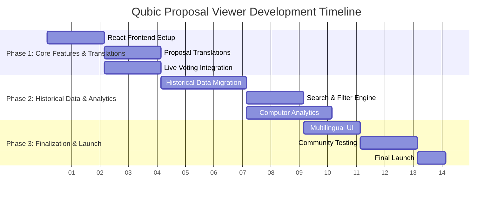

# 🌍 Qubic Proposal Viewer
### *Making Governance Accessible in Every Language*
---

**📋 Proposal Type:** Incubation Program  
**⏱️ Expected Duration:** 3 months  
**💰 Total Budget:** 9.427€ ($10.370)  
**👥 Team:** MDC  
**📂 Category:** Community Tools  

## 📝 Abstract
This proposal addresses critical gaps in Qubic's governance ecosystem: language barriers that limit global participation, limited access to proposal history, and insufficient visibility into computor voting patterns. The Qubic Proposal Viewer will provide a comprehensive web platform featuring real-time proposal translations, extended historical archives, and transparent computor voting analytics.

## 💡 Motivation
The Qubic network faces governance challenges that affect community participation:

1. **🌍 Language Barriers**: A significant portion of Qubic's global community are non-native English speakers, yet proposals remain predominantly in English, limiting their ability to participate meaningfully.

2. **📚 Limited Historical Access**: While current proposals are available on the official website for 10 epochs, older proposals become inaccessible, making it difficult to track long-term decision patterns and learn from past governance.

3. **🗳️ Limited Voting Visibility**: Computor voting patterns are not easily visible, making it challenging for the community to understand voting trends and current proposal outcomes.

## 🛠️ Solution
The Qubic Proposal Viewer is a comprehensive web platform that solves these issues through:

### 🌐 Multilingual Access
- **Full Proposal Translations**: Complete translations of all proposals into 13 languages (German, English, French, Spanish, Italian, Portuguese, Russian, Japanese, Chinese, Korean, Arabic, Turkish, Vietnamese)
- **Real-time Translation**: New proposals are translated within minutes of submission
- **Cultural Adaptation**: Translations consider context and technical terminology

### 📚 Extended Historical Archive
- **Complete Proposal Database**: All proposals from Qubic's history in one searchable platform
- **Advanced Filtering**: Search by epoch, status, author, or keywords
- **Historical Context**: Easy access to proposals beyond the 10-epoch limit of the official site

### 🗳️ Computor Voting Transparency
- **Live Voting Display**: Real-time tracking of current proposal voting status
- **Quorum Monitoring**: Clear indicators showing if proposals are meeting quorum requirements
- **Outcome Prediction**: Real-time display of whether proposals are currently passing or failing
- **Voting Pattern History**: Tracking of how individual computors vote across different proposals

## ⚙️ Technical Implementation
The platform will be built on a modern web stack with:
- **React Frontend**: Responsive design accessible on all devices
- **Node.js Backend**: Scalable API architecture
- **PostgreSQL Database**: Reliable data storage for proposals and voting history
- **Translation Engine**: AI-powered translation with quality assurance
- **Real-time Data Integration**: Live feeds from Qubic voting systems
- **Advanced Search**: Fast, relevant search across all historical data

## 🤖 Existing Proposal Bot Foundation

This project builds upon the **Qubic Proposal Bot**, a community tool I developed and maintain that currently provides:

- **Real-time Proposal Monitoring**: Automatically detects new Qubic proposals
- **AI-Powered Summaries**: Generates concise summaries using DeepSeek AI
- **Multi-Platform Support**: Operates simultaneously on Discord and Telegram
- **13 Language Support**: Delivers summaries in German, English, French, Spanish, Italian, Portuguese, Russian, Japanese, Chinese, Korean, Arabic, Turkish, and Vietnamese
- **Automatic Voting Results**: Posts epoch voting outcomes every Wednesday

The bot has been serving the community voluntarily, processing proposals and making governance information accessible across language barriers. The Qubic Proposal Viewer web platform will expand on this foundation, adding full proposal translations, comprehensive historical archives, and enhanced voting analytics.

For detailed information about the bot's features and setup instructions, visit the [GitHub Repository](https://github.com/MDC91/Qubic-Proposal-Bot).

## 🚀 Innovative Approach
- **Extended Historical Access**: Preserves Qubic governance history beyond current limits
- **Real-time Voting Transparency**: Live insights into proposal status and computor participation
- **True Global Accessibility**: Comprehensive multilingual support for diverse community
- **Community-First Design**: Built specifically for Qubic's unique governance model

## 💰 Economic Aspects
**Total Budget Requested:** 9.427€ ($10.370)

### 📊 Budget Breakdown

| Category | Amount (€) | Amount ($) | Description |
|----------|------------|------------|-------------|
| **Development** | 8.400€ | $9.240 | 240 hours × 35€/hour |
| **Infrastructure** | 165€ | $183 | Render.com (12 months) |
| &nbsp;&nbsp;Web Service | 75€ | $83 | Starter instance |
| &nbsp;&nbsp;PostgreSQL Database | 75€ | $83 | Essential plan |
| &nbsp;&nbsp;Custom Domain | 15€ | $17 | Custom Domain |
| **API & Services** | 5€ | $6 | DeepSeek Translation API |
| **Contingency (10%)** | 857€ | $943 | Buffer for unforeseen costs |
| **TOTAL** | **9.427€** | **$10.370** | |

### 💳 Payment Schedule

| Phase | Amount (€) | Amount ($) | Percentage | Deliverable |
|-------|------------|------------|------------|-------------|
| **Phase 0 - Upfront** | 1.885€ | $2.074 | 20% | Project initiation & prior work recognition |
| **Phase 1 - Milestone 1** | 2.828€ | $3.111 | 30% | Complete translations + live voting |
| **Phase 2 - Milestone 2** | 2.828€ | $3.111 | 30% | Historical archive + enhanced features |
| **Phase 3 - Final Launch** | 1.885€ | $2.074 | 20% | Production-ready platform |

## 📅 Timeline
**Total Duration:** 3 months (12 weeks)

### 📊 Gantt Chart - Project Timeline

**Legend:**
- `█` Active development
- `─` Phase boundaries  
- `│` Week markers

## 🗓️ Detailed Timeline
**Total Duration:** 3 months

### Phase 1: Core Features & Translations (Weeks 1-4)
- **Weeks 1-2**: 
  - React frontend setup with responsive design
  - Complete proposal translations (13 languages)
  - Basic UI components and navigation

- **Weeks 3-4**:
  - Backend API integration with Qubic data
  - Live voting display with quorum status
  - Public community testing for all groups

**Milestone 1**: Complete translations + live voting available

### Phase 2: Historical Data & Analytics (Weeks 5-8)
- **Weeks 5-6**:
  - Migration of available historical proposals (from Epoch 132)
  - Coordination with core team for data before Epoch 132
  - Advanced search and filtering capabilities

- **Weeks 7-8**:
  - Computor voting analytics (if data available)
  - Proposal comparison features
  - Performance optimization

**Milestone 2**: Historical archive (as available) + enhanced features

### Phase 3: Finalization & Launch (Weeks 9-12)
- **Weeks 9-10**:
  - Multilingual UI interface
  - Community feedback implementation
  - Expanded testing with global community

- **Weeks 11-12**:
  - Final testing and bug fixing
  - Documentation
  - Official launch

**Milestone 3**: Production-ready platform

### 📋 Reporting Structure
- **Milestone-based reporting**: Detailed reports after each phase completion
- **Progress communication**: Updates only for significant developments or timeline adjustments
- **Transparency**: Clear communication about any delays or challenges

## 🌍 Expected Impacts
- **Broader Global Reach**: Remove language barriers for non-English speaking communities
- **Enhanced Governance Memory**: Preserve Qubic's decision history for long-term reference
- **Improved Voting Awareness**: Real-time visibility into proposal status and computor participation
- **Increased Community Engagement**: More accessible information leads to higher participation
- **Transparent Decision Process**: Clear understanding of how governance decisions unfold

## 👤 About the Author
As a dedicated Qubic community member and DACH region community lead, I have broad experience with Qubic's ecosystem and have demonstrated commitment to building community-focused solutions. This project represents my ongoing effort to create a more accessible and transparent governance environment for all Qubic participants worldwide.

---  

**🌍 A Project for the Qubic Community**  
*Making proposals accessible to everyone, in every language*

