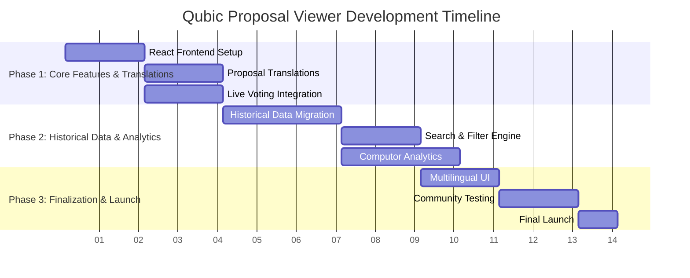

# 🚀 Qubic Proposal Viewer: Breaking Language Barriers in Qubic Governance

**📋 Proposal Type:** Incubation Program  
**⏱️ Expected Duration:** 3 months  
**💰 Total Budget:** 9.427€ ($10.370)  
**👥 Team:** MDC  
**📂 Category:** Community Tools  

## 📝 Abstract
This proposal addresses critical gaps in Qubic's governance ecosystem: language barriers that limit global participation, limited access to proposal history, and insufficient visibility into computor voting patterns. The Qubic Proposal Viewer will provide a comprehensive web platform featuring real-time proposal translations, extended historical archives, and transparent computor voting analytics.

## 💡 Motivation
The Qubic network faces governance challenges that affect community participation:

1. **🌍 Language Barriers**: A significant portion of Qubic's global community are non-native English speakers, yet proposals remain predominantly in English, limiting their ability to participate meaningfully.

2. **📚 Limited Historical Access**: While current proposals are available on the official website for 10 epochs, older proposals become inaccessible, making it difficult to track long-term decision patterns and learn from past governance.

3. **🗳️ Limited Voting Visibility**: Computor voting patterns and real-time proposal status are not easily visible, making it challenging for the community to understand voting trends and current proposal outcomes.

## 🛠️ Solution
The Qubic Proposal Viewer is a comprehensive web platform that solves these issues through:

### 🌐 Multilingual Access
- **Full Proposal Translations**: Complete translations of all proposals into 13 languages (German, English, French, Spanish, Italian, Portuguese, Russian, Japanese, Chinese, Korean, Arabic, Turkish, Vietnamese)
- **Real-time Translation**: New proposals are translated within minutes of submission
- **Cultural Adaptation**: Translations consider context and technical terminology

### 📚 Extended Historical Archive
- **Complete Proposal Database**: All proposals from Qubic's history in one searchable platform
- **Advanced Filtering**: Search by epoch, status, author, or keywords
- **Historical Context**: Easy access to proposals beyond the 10-epoch limit of the official site

### 🗳️ Computor Voting Transparency
- **Live Voting Display**: Real-time tracking of current proposal voting status
- **Quorum Monitoring**: Clear indicators showing if proposals are meeting quorum requirements
- **Outcome Prediction**: Real-time display of whether proposals are currently passing or failing
- **Voting Pattern History**: Tracking of how individual computors vote across different proposals

## ⚙️ Technical Implementation
The platform will be built on a modern web stack with:
- **React Frontend**: Responsive design accessible on all devices
- **Node.js Backend**: Scalable API architecture
- **PostgreSQL Database**: Reliable data storage for proposals and voting history
- **Translation Engine**: AI-powered translation with quality assurance
- **Real-time Data Integration**: Live feeds from Qubic voting systems
- **Advanced Search**: Fast, relevant search across all historical data

*Note: This project builds upon existing community-developed infrastructure for proposal monitoring, adapting and expanding it for web accessibility.*

## 🚀 Innovative Approach
- **Extended Historical Access**: Preserves Qubic governance history beyond current limits
- **Real-time Voting Transparency**: Live insights into proposal status and computor participation
- **True Global Accessibility**: Comprehensive multilingual support for diverse community
- **Community-First Design**: Built specifically for Qubic's unique governance model

## 💰 Economic Aspects
**Total Budget Requested:** 9.427€ ($10.370)

### 📊 Budget Breakdown

| Category | Amount (€) | Amount ($) | Description |
|----------|------------|------------|-------------|
| **Development** | 8.400€ | $9.240 | 240 hours × 35€/hour |
| **Infrastructure** | 165€ | $183 | Render.com (12 months) |
| &nbsp;&nbsp;Web Service | 75€ | $83 | Starter instance |
| &nbsp;&nbsp;PostgreSQL Database | 75€ | $83 | Essential plan |
| &nbsp;&nbsp;Custom Domain | 15€ | $17 | qubic-viewer.org |
| **API & Services** | 5€ | $6 | DeepSeek Translation API |
| **Contingency (10%)** | 857€ | $943 | Buffer for unforeseen costs |
| **TOTAL** | **9.427€** | **$10.370** | |

### 💳 Payment Schedule

| Phase | Amount (€) | Amount ($) | Percentage | Deliverable |
|-------|------------|------------|------------|-------------|
| **Phase 0 - Upfront** | 1.885€ | $2.074 | 20% | Project initiation & prior work recognition |
| **Phase 1 - Milestone 1** | 2.828€ | $3.111 | 30% | Complete translations + live voting |
| **Phase 2 - Milestone 2** | 2.828€ | $3.111 | 30% | Historical archive + enhanced features |
| **Phase 3 - Final Launch** | 1.885€ | $2.074 | 20% | Production-ready platform |

## 📅 Timeline
**Total Duration:** 3 months (12 weeks)

### 📊 Gantt Chart - Project Timeline

**Legend:**
- `█` Active development
- `─` Phase boundaries  
- `│` Week markers

## 🗓️ Detailed Timeline
**Total Duration:** 3 months

### Phase 1: Core Features & Translations (Weeks 1-4)
- **Weeks 1-2**: 
  - React frontend setup with responsive design
  - Complete proposal translations (13 languages)
  - Basic UI components and navigation

- **Weeks 3-4**:
  - Backend API integration with Qubic data
  - Live voting display with quorum status
  - Public community testing for all groups

**Milestone 1**: Complete translations + live voting available

### Phase 2: Historical Data & Analytics (Weeks 5-8)
- **Weeks 5-6**:
  - Migration of available historical proposals (from Epoch 132)
  - Coordination with core team for data before Epoch 132
  - Advanced search and filtering capabilities

- **Weeks 7-8**:
  - Computor voting analytics (if data available)
  - Proposal comparison features
  - Performance optimization

**Milestone 2**: Historical archive (as available) + enhanced features

### Phase 3: Finalization & Launch (Weeks 9-12)
- **Weeks 9-10**:
  - Multilingual UI interface
  - Community feedback implementation
  - Expanded testing with global community

- **Weeks 11-12**:
  - Final testing and bug fixing
  - Documentation
  - Official launch

**Milestone 3**: Production-ready platform

### 📋 Reporting Structure
- **Milestone-based reporting**: Detailed reports after each phase completion
- **Progress communication**: Updates only for significant developments or timeline adjustments
- **Transparency**: Clear communication about any delays or challenges

## 🌍 Expected Impacts
- **Broader Global Reach**: Remove language barriers for non-English speaking communities
- **Enhanced Governance Memory**: Preserve Qubic's decision history for long-term reference
- **Improved Voting Awareness**: Real-time visibility into proposal status and computor participation
- **Increased Community Engagement**: More accessible information leads to higher participation
- **Transparent Decision Process**: Clear understanding of how governance decisions unfold

## 👤 About the Author
As a dedicated Qubic community member and DACH region community lead, I have broad experience with Qubic's governance ecosystem and have demonstrated commitment to building community-focused solutions. This project represents my ongoing effort to create a more accessible and transparent governance environment for all Qubic participants worldwide.
